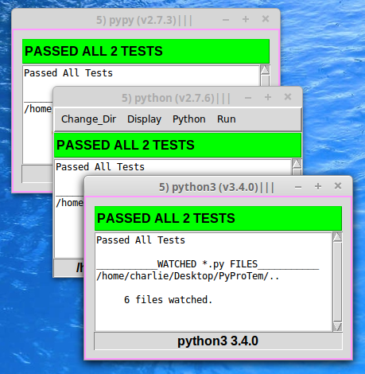

.. Tk_Nosy

.. image:: https://img.shields.io/travis/sonofeft/Tk_Nosy.svg
        :target: https://travis-ci.org/sonofeft/Tk_Nosy

.. image:: https://img.shields.io/pypi/v/Tk_Nosy.svg
    :target: https://pypi.python.org/pypi/tk_nosy
        
.. image:: https://img.shields.io/pypi/pyversions/Tk_Nosy.svg
    :target: https://wiki.python.org/moin/Python2orPython3

.. image:: https://img.shields.io/pypi/l/Tk_Nosy.svg
    :target: https://pypi.python.org/pypi/tk_nosy

Tk_Nosy Overview
================

Tk_Nosy monitors project and unittest python files and runs nosetests when they change.

The goal of Tk_Nosy is to encourage unit testing. This helps a developer use 
Test Driven Development (TDD) regardless of the editor or IDE being used.

Tk_Nosy will run nosetests with any python interpreter when any files
under development change.  In addition to conventional CPython, PYPY is also acceptable.

It can run any number of python interpreters concurrently such that, for example, 
python 2 and python 3 conventions can both be monitored at the same time. 
The image below shows concurrent nosetests for pypy as well as standard CPython python 2.7.9 and 3.4.3 running on both **Windows and Linux**.

.. image:: _static/watch_3_py.png
    :width: 45%

See the Code at: `<https://github.com/sonofeft/Tk_Nosy>`_

See the Docs at: `<http://tk_nosy.readthedocs.org/en/latest/>`_

See PyPI page at:`<https://pypi.python.org/pypi/tk_nosy>`_

A project layout such as that shown below is typical for Tk_Nosy to monitor::

    MyProject/
        myproject/
            __init__.py
            mycode.py
        docs/
        tests/
            __init__.py
            test_mycode.py
        LICENSE.txt
        MANIFEST.in
        README.rst
        requirements.txt
        setup.cfg
        setup.py
        tk_nosy.py
        tox.ini

Contents:

.. toctree::
   :maxdepth: 2

   quickstart 
   tdd 
   history
   functions

Indices and tables
==================

* :ref:`genindex`
* :ref:`modindex`
* :ref:`search`

