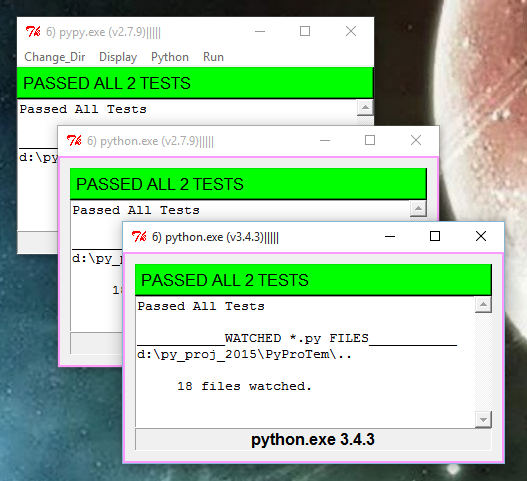

.. Tk_Nosy

.. image:: https://travis-ci.org/sonofeft/Tk_Nosy.svg?branch=master
    :target: https://travis-ci.org/sonofeft/Tk_Nosy

Tk_Nosy Overview
================

Tk_Nosy monitors project and unittest python files and runs nosetests when they change.

The goal of Tk_Nosy is to encourage unit testing. This helps a developer use 
Test Driven Development (TDD) regardless of the editor or IDE being used.

Tk_Nosy will run nosetests with any python interpreter when any files
under development change.  

It can run any number of python interpreters concurrently such that, for example, 
python 2 and python 3 conventions can both be monitored at the same time. 
The image below shows concurrent nosetests for pypy as well as standard CPython python 2.7.9 and 3.4.3.

In addition to conventional CPython, PYPY is also acceptable.

A project layout such as that shown below is typical for Tk_Nosy to monitor::

    MyProject/
        myproject/
            __init__.py
            mycode.py
        docs/
        tests/
            __init__.py
            test_mycode.py
        LICENSE.txt
        MANIFEST.in
        README.rst
        requirements.txt
        setup.cfg
        setup.py
        tk_nosy.py
        tox.ini

Install
=======

The easiest way to install Tk_Nosy is::

    pip install tk_nosy

Installation From Source
========================

Much less common, but if installing from source, then
the best way to install Tk_Nosy is to use pip after navigating to the directory holding Tk_Nosy::

    cd full/path/to/Tk_Nosy
    pip install -e .
    
        OR on Linux
    sudo pip install -e .
        OR perhaps
    pip install --user -e .
    
This will execute the local ``setup.py`` file and insure that the pip-specific commands in ``setup.py`` are run.

Running Tk_Nosy
===============

After installing with pip, there will be a launch command line program called **tk_nosy** or, on Windows, **tk_nosy.exe**.

The path for the tk_nosy executable might be something like::

    /usr/local/bin/tk_nosy          (if installed with sudo pip install -e .)
      or 
    /home/<user>/.local/bin/tk_nosy (if installed with pip install -e .)
      or 
    C:\Python27\Scripts\tk_nosy.exe (on Windows)

Make sure your system path includes the above path to **tk_nosy**.

The best way to run Tk_Nosy is to use the command line to navigate to the directory being developed and simply type::

    cd <path to my project>
    tk_nosy
    
      or without cd command 
      
    tk_nosy <path to my project>
    
If tk_nosy detects a project in the local directory, it will launch nosetests, show results and start watching python files for changes.  If there is no project detected, it will ask for a directory to watch.

It is possible to run Tk_Nosy directly from source without installing it. Simply navigate to the source files and type::

    python main_gui.py
      or
    python main_gui.py <name of directory to watch>

Contents:

.. toctree::
   :maxdepth: 2

   tdd 
   functions

Indices and tables
==================

* :ref:`genindex`
* :ref:`modindex`
* :ref:`search`

